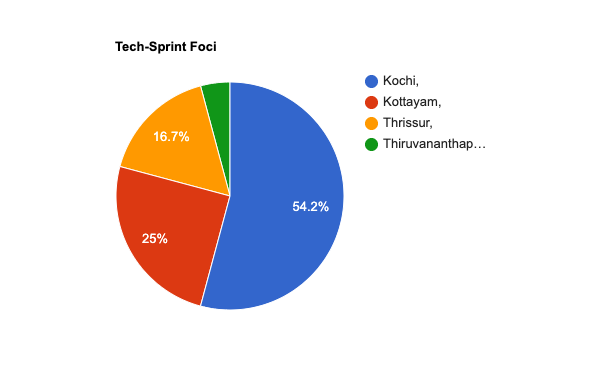

# Fostering the Idea of Define

> **Technology brings new notions when properly fostered. And young minds capture the most when led by example.**

The notion of Define 2022 was first conceived as a continual tradition of a hackathon, usually organized as part of the college Tech Fest - <mark style="color:red;">Hash 2022</mark>. A 24-hour hackathon for our students to spend time and bring solutions to issues they think matter.

To be held in the vast expanse of [Mar Baselios College of Engineering and Technology](https://goo.gl/maps/x1xXMEcx3TJr6DD49), it was planned on a scale that provides insight and exposure. From the initial cause, as the plans developed, it was found that there are more to be looked at. And this brought another version to Define.

<figure><figcaption>
Fig: Tech event demographics in Kerala
</figcaption></figure>

**Thiruvananthapuram** is known for its bright and cultural expanse, which once used to be a forum for meetups, tech events, and community initiatives that foster student growth and build up a tech ecosystem. The pandemic brought a stark change as the online mode came to prominence.

Even after **“coming back to the offline world”**, the tech-focused or developer sprint events got clustered to Kochi, Kottayam, etc., For the past 3-4 years, there hasn’t been a prominent tech-focused event or scale-hackathons that can be said “**Thiruvananthapuram-based”**

**Possible reasons are identified as:**

* Community spaces are not easily available
* Cultural events got a dominant at Thiruvananthapuram
* The proximity of not being a tech hub or having a focused ecosystem.

As the story progressed, **Define** became our vision to **circle back the hackathon spirit to the capital city** on a good scale. Secondly, **to provide an experience to younger gens** - true hackathon exposure.

